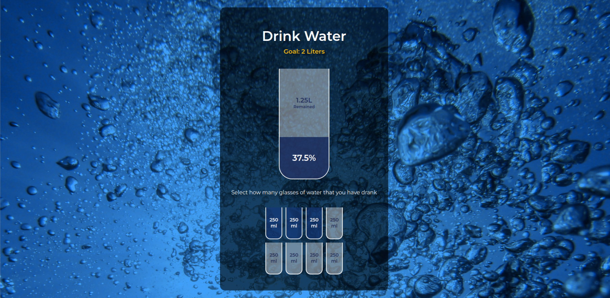

# Water Drinking Calculator / Reminder

A lsimple app that tracks the drinking water consumption. The Goal is to drink 2 liters of water per day

## HTML/CSS Part

- I added "aiding classes" (.full) while styling the small cups, then removed it again after making sure that it worked.

- Same with percentages (20%) and 1.5L as a placeholder....

## JavaScript Part

- DOM manipulation
- Calculations
- forEach() Method

## Screenshot

